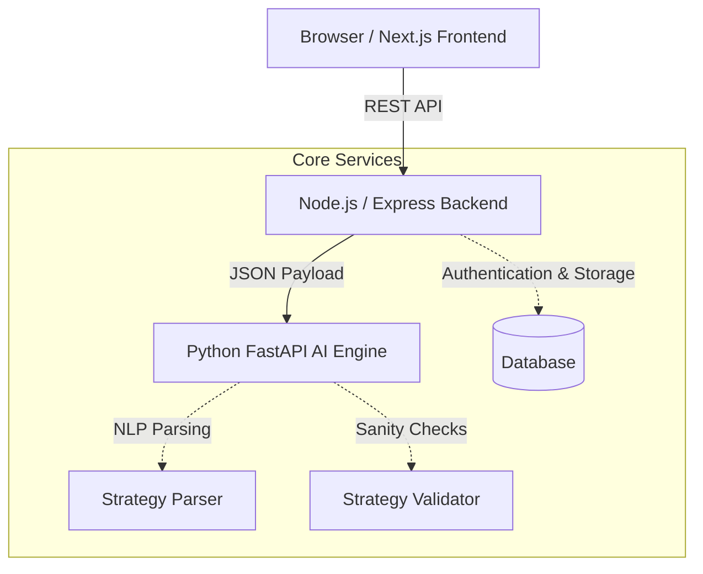

# 🚀 Stratify — Ultimate AI-Powered Algorithmic Trading SaaS

<div align="center">


**A flagship enterprise-grade SaaS platform that translates natural language into backtestable algorithmic trading strategies using AI, NLP, and a robust microservices architecture.**

[🌟 Features](#-key-features) • [🏗️ Architecture](#-system-architecture) • [🧠 AI Engine](#-ai-engine-deep-dive) • [🚀 Quick Start](#-quick-start) • [🗂️ Structure](#-project-structure)

</div>

---

## 📌 Overview

**Stratify** is a next-generation FinTech SaaS platform designed to democratize algorithmic trading. It allows users to write trading rules in plain English (e.g., *"Buy BTC when RSI drops below 30 on the 1H timeframe"*), and seamlessly converts them into structured, executable trading logic.

Built with scale and performance in mind, the system uses a **tri-service architecture** separating the client interface, user management backend, and the heavy-lifting Python AI parsing engine.

### 🌟 Key Features
- **Natural Language Parsing:** Translates human sentences into structured quantitative trading rules.
- **Strategy Validation & Risk Analysis:** Automatically checks generated rules for logical contradictions, missing data requirements, and dangerous position sizing.
- **Microservices Design:** Fully decoupled architecture allowing independent scaling of the web application, primary database, and machine learning components.
- **Deterministic AI Fallback:** Utilizes advanced Regex and NLP parsing ensuring zero hallucination for critical financial logic.

---

## 🏗️ System Architecture

Stratify is divided into three distinct, independently deployable microservices:



### 1. Frontend Client (Next.js & Tailwind)
- Server-Side Rendered (SSR) React application for optimal SEO and fast load times.
- State-of-the-art UI/UX built with TailwindCSS.
- Real-time feedback for trading rule validation.

### 2. Primary Backend (Node.js & Express)
- Handles authentication, session management, and user data persistence.
- Acts as a secure proxy to the Python AI engine.

### 3. AI Engine (Python & FastAPI)
- High-performance, asynchronous REST API.
- Implements `StrategyParser` to extract indicators, operators, and actions.
- Implements `StrategyValidator` to compute risk scores and flag logical conflicts.

---

## 🧠 AI Engine Deep Dive

The crown jewel of Stratify is the Python-based AI Engine. Built with absolute safety in mind for financial contexts, it operates purely deterministically with Pydantic validation.

### Endpoints
- `POST /parse-strategy`: Takes raw human language and outputs a structured rule array with confidence scores.
- `POST /validate-strategy`: Syntactically and logically validates rules. Detects timeframe mismatches, inaccessible indicators, and contradictory logic (e.g., *RSI > 70 AND RSI < 30*).

### Example JSON Flow

**Input:**
```json
{
  "language_input": "Buy BTC when RSI is less than 30",
  "symbol": "BTC/USD",
  "timeframe": "1h"
}
```

**Parsed & Validated Output:**
```json
{
  "valid": true,
  "risk_score": 15,
  "generated_rules": [
    {
      "indicator": "RSI",
      "operator": "<",
      "value": 30,
      "action": "BUY",
      "confidence": 0.98
    }
  ]
}
```

---

## 🚀 Quick Start

### Prerequisites
- Node.js 18+
- Python 3.11+
- `pip` and `npm`

### 1. Start the AI Engine (Python)

```bash
cd Stratify/ai-engine
python -m venv venv
source venv/bin/activate  # On Windows: venv\Scripts\activate
pip install -r requirements.txt
uvicorn main:app --reload --port 8001
```

### 2. Start the Backend API (Node.js)

```bash
cd Stratify/backend
npm install
npm run dev
# Server starts on port 5000 by default
```

### 3. Start the Frontend (Next.js)

```bash
cd Stratify/frontend
npm install
npm run dev
# Server starts on port 3000
```

---

## 🗂️ Project Structure

```text
Stratify-Ultimate-AI-Powered-Saas/
└── Stratify/
    ├── frontend/               # Next.js 14 Client
    │   ├── app/                # App Router pages
    │   ├── components/         # Reusable React UI components
    │   └── tailwind.config.ts  # Styling rules
    │
    ├── backend/                # Express API Server
    │   ├── controllers/        # Business logic for users/auth
    │   ├── models/             # Database schemas
    │   └── routes/             # Express API endpoints
    │
    └── ai-engine/              # Python FastAPI Service
        ├── main.py             # Uvicorn entry point
        ├── strategy_parser/    # NLP & Regex NLP parsing logic
        ├── validation/         # Risk and logical contradiction checkers
        └── backtesting/        # Market data fetching stubs
```

---

## 👨‍💻 Author & Lead Engineer

**Ahtesham Shah**
- 🌐 [GitHub](https://github.com/Ahtesham-Shah999)
- 💼 Full Stack AI & FinTech Engineer

---

## 📄 License

This software is highly proprietary. Please contact the author for licensing inquiries.

---

<div align="center">
  <i>⭐ Designed to bridge the gap between human intuition and algorithmic precision.</i>
</div>
